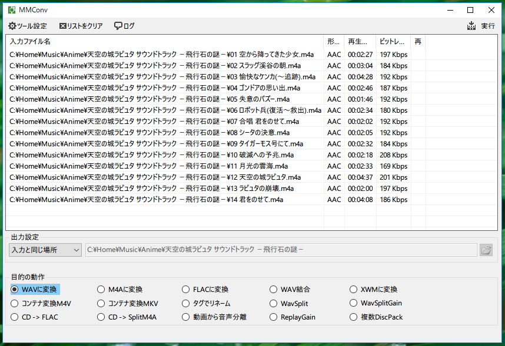

# MMConv

  

外部のCLIを使用した、多目的コンバータです  

- WAVに変換
  - ffmepgでWav変換します
  - flacのみflac.exeでWav変換します
- M4Aに変換
  - neroAacEncで変換します
  - サンプリングレートが48000以上の場合はsoxで48000化されます
  - mp3gainでリプレイゲインを行います
- FLACに変換
  - flacで変換します
- WAV結合
  - 登録したWavファイルを連結します
  - 連結後のCueシートを出力します
- WAV無音カット
  - 未実装です
- コンテナ変換M4A
  - ffmepgで再圧縮せずにコンテナを変換するように試みます
- コンテナ変換MKV
  - ffmepgで再圧縮せずにコンテナを変換するように試みます
- タグでリネーム
  - $(index) $(title).$(ext) みたいな感じにリネーム
  - ディスク番号にも対応、$(dickNo) - が付く感じ
- WavSplit
  - 入力したWavと同じ名前のCueシートを読み込んでWav分割します
- WavSplitGain
  - WavSplit後にWaveGainでリプレイゲインを行います
- CD -> FLAC
  - 入力したWavとFLACに変換します
  - FLACに変換時に同じ名前のCueとJpgを埋め込みます
  - 変換したFLACとjpg、log、ブックレットなどをzipでパックします
- CD -> SplitM4A
  - WavSplit分割後にM4A変換リプレイゲインを行います
- 動画から音声分離
  - ffprobeを使用してmp3、ogg、aacのいづれかの場合に出力
- ReplayGain
  - リプレイゲインを行います
- 複数DickPack
  - ファイル名に沿ったものを列挙してzipでパックします

- 対応するツール等
  - ffmpeg
  - flac
  - neroAacEnc
  - mp3gain
  - takc
  - shntool
  - sox
  - 7z
  - WaveGain